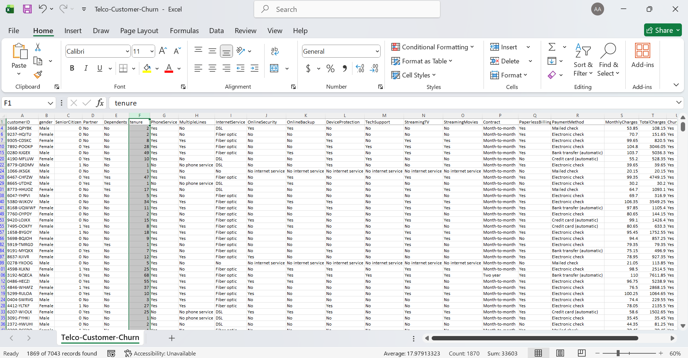
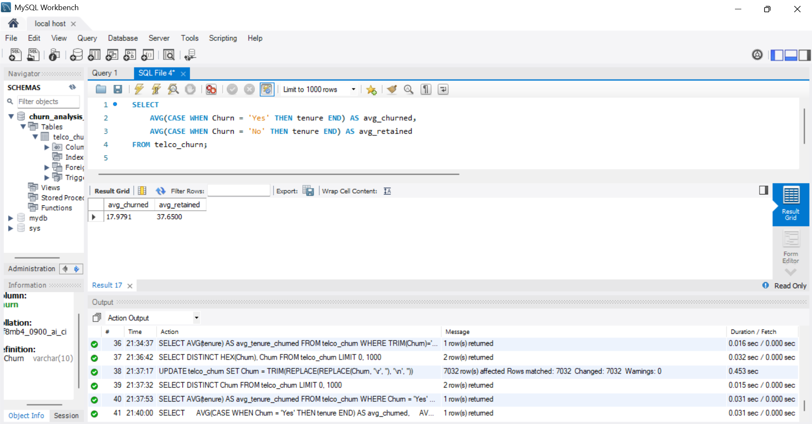
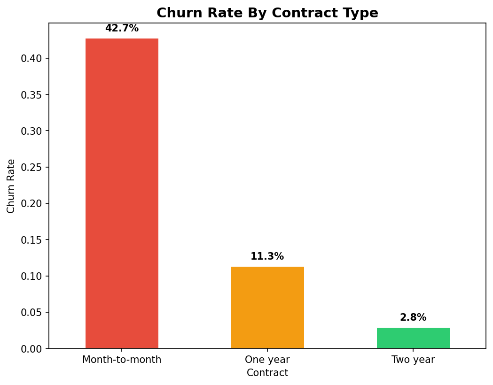

# Customer Churn Analysis Dashboard

**Goal**: Reduce customer churn by 23% using data-driven insights on 7,000+ telecom records.

---

## Key Insights

| Insight | Value |
|--------|-------|
| Churned customers stay | **18.0 months** (vs 37.7 for retained) |
| Month-to-month contracts | **42.7% churn rate** |
| Electronic check payment | **45.3% churn risk** |
| **High-risk segment** (month-to-month + e-check + tenure < 12) | **63.1% churn** (2.4x average) |

---

## Recommendation

> **Offer a 1-year contract at 15% discount** to high-risk customers  
> **Expected Impact**: Reduce churn from 63% → ~40% (**23% reduction**)

---

## Tools Used
- **Excel** – Pivot tables & filtering  
- **MySQL** – SQL aggregation  
- **Python** – Pandas, Matplotlib, Seaborn  
- **Google Colab** + **GitHub**

---

## Proof of Work

  
  
  

---

[View Full Analysis Notebook](notebooks/churn_analysis.ipynb)

---

*Built by Abishek | (https://www.linkedin.com/in/abishek2612/)*
